# Depuração (_debug_)

É o processo de encontrar e corrigir erros durante o desenvolvimento de um software.

A maioria das linguagens possuem softwares que permitem acompanhar a execução do programa linha-a-linha, visualizando a situação atual do programa. Isso pode ajudar no entendimento de erros de lógica. Tais softwares são chamados "depuradores" (_debuggers_). O compilador GNU C é acompanhado pelo debugger GDB (GNU Debugger).

Muitas IDEs disponibilizam ferramentas gráficas para facilitar o processo de depuração. O Code::Blocks é uma delas.

## Depurando no Code::Blocks

Começamos com um programa trivial.

```c
#include <stdio.h>
#include <stdlib.h>

int main()
{
    int x, y, z;
    x = 7;
    y = 8;
    z = x + y;
    z = z + 1;
    printf("%d", z);
    return 0;
}
```

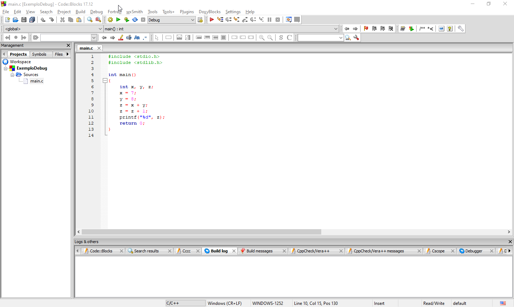

Queremos acompanhar sua execução passo-a-passo, utilizando o depurador.

Começamos colocando um ponto de parada (_breakpoint_), clicando na coluna cinza ao lado direito do número da linha onde queremos a parada (linha 6).

A IDE sinalizará com um ícone de círculo vermelho.

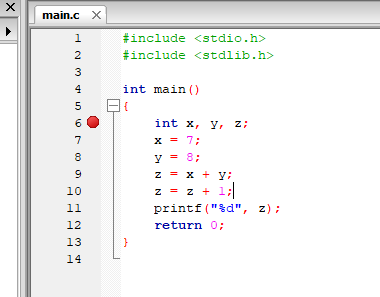

Precisamos agora executar o programa. Porém, devemos executá-lo via depurador, não diretamente. Controlamos o depurador através da barra de comandos de depuração:

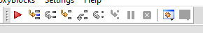

Ao acionarmos a opção "Debug/Continue", o depurador seguirá até o próximo _breakpoint_. No nosso caso, parará na primeira linha executável após a linha indicada (linha 7).

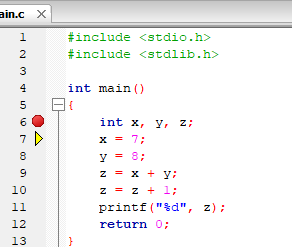

Também podemos utilizar o menu "Debug".

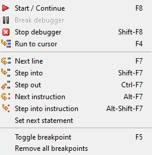

Várias janelas com informações adicionais podem ser exibidas.

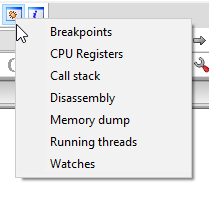
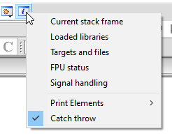

Por exemplo, a janela "watches", que permite visualizar os valores das variáveis.

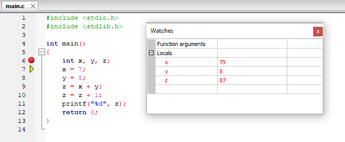

Para executar linha-a-linha, podemos utilizar a função "Next Line".

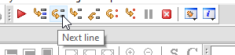

Perceba que as variáveis possuem valores indefinidos até que sejam inicializadas, e a janela "Watches" mostra os valores atuais, variando conforme as linha vão sendo executadas.

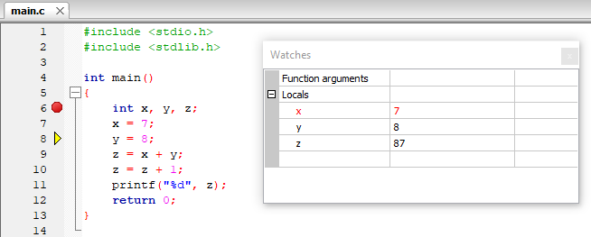
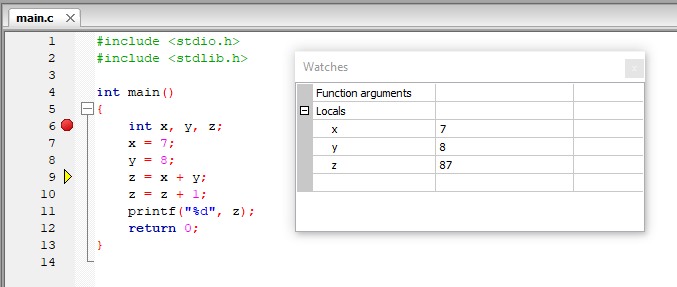
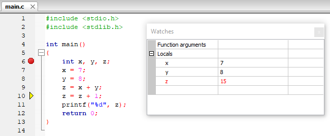
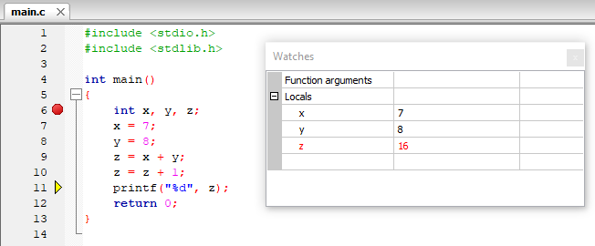

Tal procedimento permite entender a sequência de execução dos comandos, e visualizar os estados intermediários das suas variáveis.

## Visualizando o código de máquina

Podemos visualizar o código _assembly_ gerado através da janela "Disassembly".

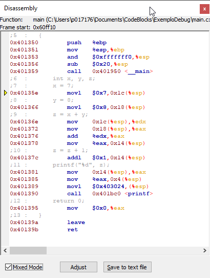
