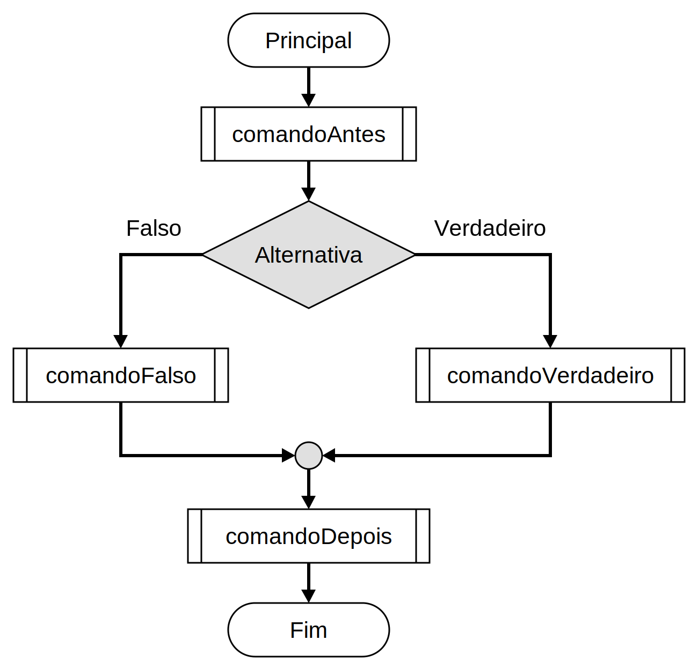

# Decisão simples

Permite que um comando seja ou não seja executado, de acordo com uma condição.

Por exemplo, queremos implementar o seguinte algoritmo:

```
- Receba a nota da prova 1.
- Receba a nota da prova 2.
- Calcule a média das notas das duas provas.
- Se a média for abaixo de 5, então informe que o aluno foi reprovado.
- Senão, informe que o aluno foi aprovado.
```

Conseguimos resolver alguns pontos facilmente. Os comandos de entrada, por exemplo, podem ser implementados assim:

```c
float p1, p2, media;

printf("Nota da P1: ");
scanf("%f", &p1);

printf("Nota da P2: ");
scanf("%f", &p2);
```
Em seguida, podemos calcular a média.

```c
media = (p1 + p2) / 2.;
```

Podemos até exibir a média (apesar do algoritmo não exigir tal passo, fazemos por facilidade ao usuário).

```c
printf("Média: %.2f\n", media);
```

Agora, para exibir a mensagem final, temos duas alternativas:

```c
printf("Aprovado");
```
e

```c
printf("Reprovado");
```

Precisamos de uma maneria de escolher somente um dos comandos, de acordo com a nota.

## Comando `if`

Executa comandos condicionalmente, baseado no resultado de uma expressão.

```c
if (teste)
    comando_entao
else
    comando_senao
```

O comando representado por `comando_entao` só será executado se a expressão representada por `teste` resultar em um resultado verdadeiro (qualquer valor diferente de zero).

O comando representado por `comando_senao` só será executado se a expressão representada por `teste` resultar em um resultado falso (somente o valor zero).

Os comandos `comando_entao` e `comando_senao` são mutuamente exclusivos: se um for executado, o outro não será.

No exemplo do cálculo da média, poderíamos utilizar:

```c
if (media >= 5.)
    printf("Aprovado");
else
    printf("Reprovado");
```
### Construções possíveis

Nas imagens abaixo, `comando___` representa um [comando](statements.MD) qualquer, `Alternativa` e `alternativa___` representam uma [expressão](expressions_operators.MD) lógica.

#### `if` com `else`

Neste caso, necessitamos de dois comandos diferentes, um em caso verdadeiro e outro em caso falso.



```c
comandoAntes;
if (Alternativa)
    comandoVerdadeiro;
else
    comandoFalso;
comandoDepois;
```

Exemplo:

Exibir se uma pessoa é menor ou maior de idade.

```c
int idade = 74;
if (idade < 18)
    printf("Menor de Idade");
else
    printf("Maior de Idade");
```

É uma boa prática utilizar blocos sempre, mesmo que tenhamos somente um comando.

```c
int idade = 74;
if (idade < 18)
{
    printf("Menor de Idade");
}
else
{
    printf("Maior de Idade");
}
```

#### `if` sem `else`

Neste caso, necessitamos de um comando a mais no caso verdadeiro, mas nada a fazer caso falso.


```c
comandoAntes;
if (Alternativa)
    comandoVerdadeiro;
comandoDepois;
```

Exemplo:

Exibir uma mensagem específica somente se a pessoa tiver 15 anos.

```c
int idade = 12;
if (idade == 15)
{
    printf("Parabéns, debutante!");
}
```

#### `if` com `else`, utilizando blocos

Neste caso, necessitamos de mais de um comando diferente para cada um dos casos.


```c
comandoAntes;
if (Alternativa)
{
    comandoVerdadeiro;
    comandoVerdadeiro2;
}
else
{
    comandoFalso;
    comandoFalso2;
}
comandoDepois;
```

Exemplo:

Menores de idade não recebem benefício. Maiores de idade recebem R$ 100,00 por filho.

```c
const float SALARIO_BASE = 998.;
const float BENEFICIO_POR_FILHO = 100.;

float salario;
int idade = 42, numFilhos = 2;

if (idade < 18)
{
    salario = SALARIO_BASE;
}
else
{
    float beneficio = numFilhos * BENEFICIO_POR_FILHO;
    salario = SALARIO_BASE + beneficio;
}
```

#### `if` sem `else`, utilizando blocos


```c
comandoAntes;
if (Alternativa)
{
    comandoVerdadeiro;
    comandoVerdadeiro2;
}
comandoDepois;
```

#### `else if`

Esta construção permite testar condições altamente relacionadas, uma das formas de se fazer desvio múltiplo.


```c
comandoAntes;
if (alternativa1)
{
    comando1;
}
else if (alternativa2)
{
    comando2;
}
else if (alternativa3)
{
    comando3;
}
else
{
    comandoElse;
}
comandoDepois;
```

Exemplo:

Exibir se a pessoa é criança, adolescente, adulto ou idoso.

```c
unsigned int idade = 35;
if (idade <= 12)
{
    printf("Criança");
}
else if (idade <= 17)
{
    printf("Adolescente");
}
else if (idade < 65)
{
    printf("Adulto");
}
else
{
    printf("Idoso");
}
```

#### `if`'s aninhados

Podemos criar qualquer tipo de lógica, imaginando que cada comando pode ser também outro `if`.


```c
comandoAntes;
if (alternativa1)
{
    comando1;
    if (alternativa2)
    {
        comando3;
    }
    else
    {
        comando4;
    }
    comando5;
}
else
{
    comando2;
}
comandoDepois;
```

Exemplo:

Em um jogo de _adivinha_, o usuário diz um número de 1 a 100. Se ele adivinhar, ganha o jogo. Se ele errar, dê uma pista (é maior ou é menor). Caso esteja fora da faixa, exiba uma mensagem de orientação.

```c
int numeroMagico = 73;

int numeroDigitado;

printf("Digite um número: ");
scanf("%d", &numeroDigitado);

if (numeroDigitado < 1 || numeroDigitado > 100)
{
    printf("Número inválido. Digite um número entre 1 e 100.");
}
else
{
    if (numeroDigitado == numeroMagico)
    {
        printf("Você acertou!");
    }
    else
    {
        if (numeroDigitado < numeroMagico)
        {
            printf("O número que você digitou é menor. Digite um número maior que %d.", numeroDigitado);
        }
        else
        {
            printf("O número que você digitou é maior. Digite um número menor que %d.", numeroDigitado);
        }
    }
}
```
