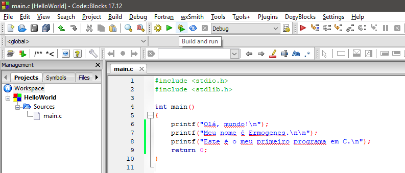
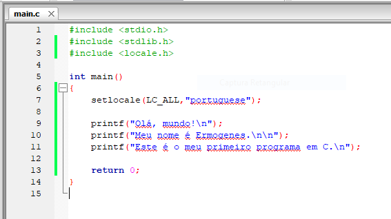
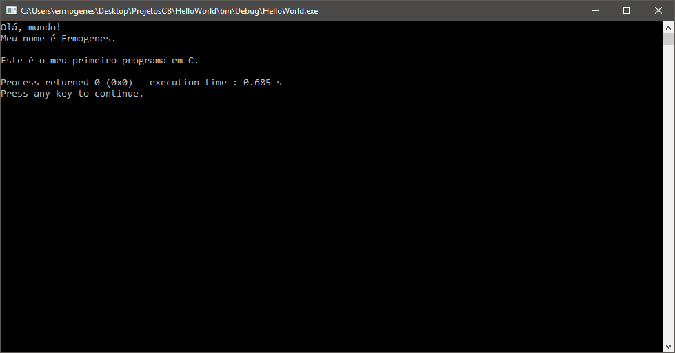
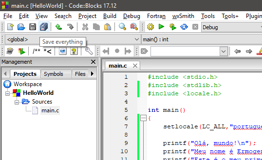
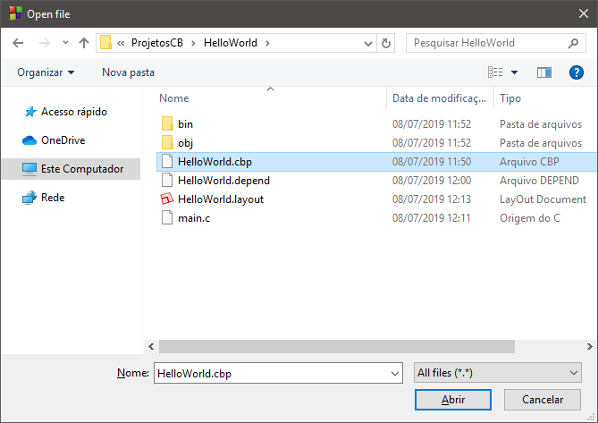

# Criando o primeiro projeto em C no Code::Blocks

* Abrir o Code::Blocks:


* Inicie um projeto novo, clicando em `File > New > Project...` e selecione o _template_ `Console Application` e a linguagem C:


* Defina um nome para o projeto e o local de salvamento. Para este tutorial, usamos o nome `HelloWorld` e o local `C:\Users\ermogenes\Desktop\ProjetosCB\HelloWorld` (escolha a pasta de sua preferência).


* Escolha o compilador GNU GCC Compiler e mantenha a criação dos diretórios de Debug e Release com as opções padrão.


* O projeto será criado com um programa de exemplo:


* Estes são os arquivos criados até agora:
  - `HelloWorld.cbp`: configurações do projeto
  - `main.c`: arquivo de código-fonte principal do programa
  


* Criado o projeto, vamos compilá-lo executando o processo de Build:


* Serão criados diretórios com os arquivos-objeto (`obj`) e com os binários executáveis (`bin`), nas suas versões Debug.


* Execute o programa:


* Pressione `ENTER` duas vezes para retornar à IDE.

# Melhorando o programa

* Modifique a mensagem exibida:

```c
#include <stdio.h>
#include <stdlib.h>

int main()
{
    printf("Olá, mundo!\n");
    printf("Meu nome é Ermogenes.\n\n");
    printf("Este é o meu primeiro programa em C.\n");
    return 0;
}
```

* Compile e execute, utilizando o comando `Build and Run`:



* Perceba que os acentos e caracteres especiais utilizados pelo compilador não correspondem ao padrão do sistema operacional.


* Faça as alterações abaixo para configurar corretamente o local:



...
```c
#include <locale.h>
```
...
```c
setlocale(LC_ALL,"portuguese");
```
...

* Ao compilar e executar novamente temos a versão correta.



* Salve seu projeto.



* Terminado. Pode fechar o Code:Blocks. Quando precisar abrir novamente, use a opção `File > Open...` e escolha o arquivo do projeto `.cbp`:


