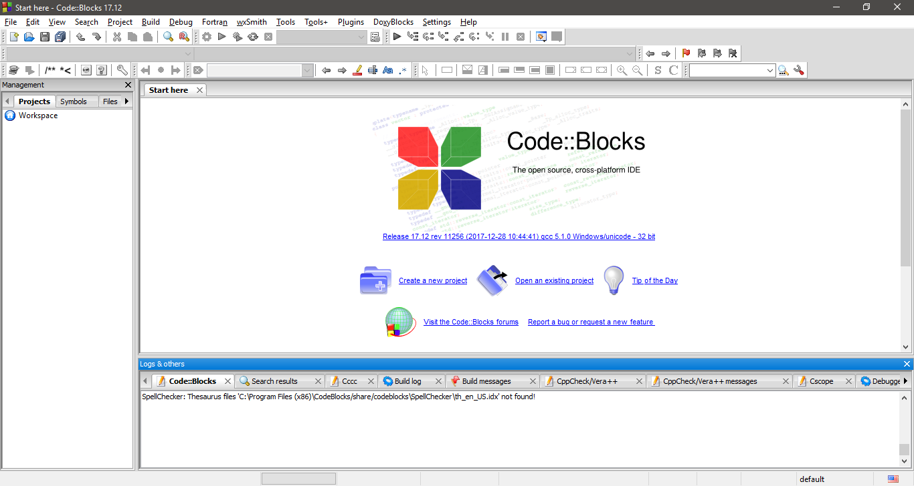
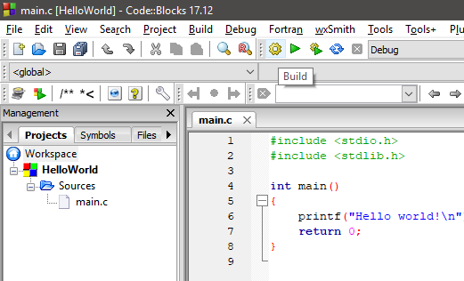

# Criando o primeiro projeto em C no Code::Blocks

* Abrir o Code::Blocks:

* Inicie um projeto novo, clicando em `File > New > Project...` e selecione o _template_ `Console Application` e a linguagem C:

* Defina um nome para o projeto e o local de salvamento. Para este tutorial, usamos o nome `HelloWorld` e o local `C:\Users\ermogenes\Desktop\ProjetosCB\HelloWorld` (escolha a pasta de sua preferência).

* Escolha o compilador GNU GCC Compiler e mantenha a criação dos diretórios de Debug e Release com as opções padrão.

* O projeto será criado com um programa de exemplo:

* Estes são os arquivos criados até agora:
  - `HelloWorld.cbp`: configurações do projeto
  - `main.c`: arquivo de código-fonte principal do programa
  

* Criado o projeto, vamos compilá-lo executando o processo de Build:

* Serão criados diretórios com os arquivos-objeto (`obj`) e com os binários executáveis (`bin`), nas suas versões Debug.

* Execute o programa:

