# git e GitHub

## Instalando o git

* Baixe e instale o [Git para Windows](https://git-scm.com/download/win).
* Para testar se a instalação está correta, abra o Prompt de Comando e execute `git --version`. Será exibida a versão do git instalada.

```
C:\Users\ermogenes\> git --version
git version 2.16.2.windows.1

C:\Users\ermogenes\> 
```

## Criando uma conta no GitHub

* Crie um perfil em https://github.com/. Guarde bem o e-mail, o nome de usuário e a senha.
* Efetue o login.

## Configurando o seu usuário no git local

Execute os comando abaixo com seu nome e e-mail (utilizado no GitHub):

```
git config --global user.name "Seu Nome"
git config --global user.email seuemail@example.com
```

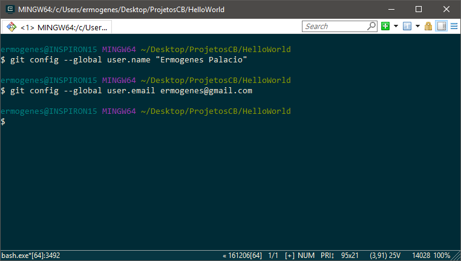

Para testar se deu certo, digite:

```
git config user.name
```

_Obs.: Pode ser necessário executar esse passo sempre que utilizar um computador da Etec._

## Criando um novo repositório no GitHub

* Estando logado, acesse a opção `New Repository`:

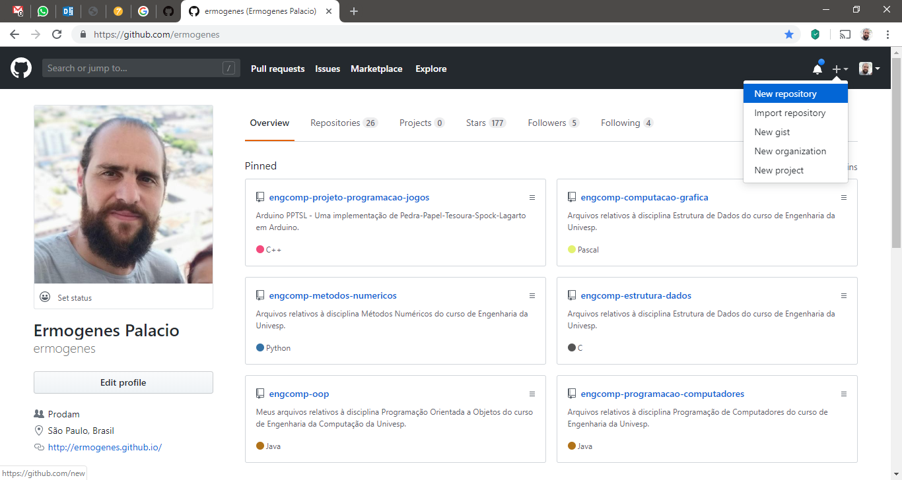

* Configure o nome do repositório (ex.: `hello-world-github-c`), sua descrição e ative a criação do arquivo `README`.

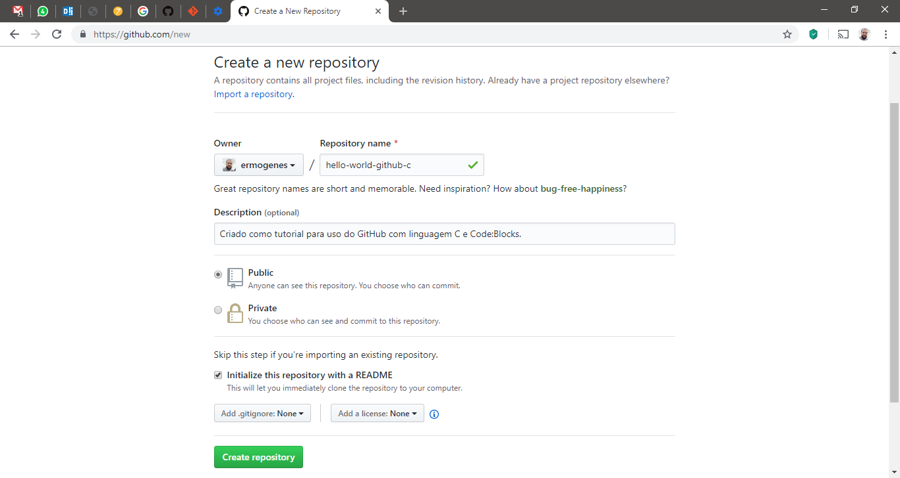

* Ao final, será exibida a página inicial do seu repositório.

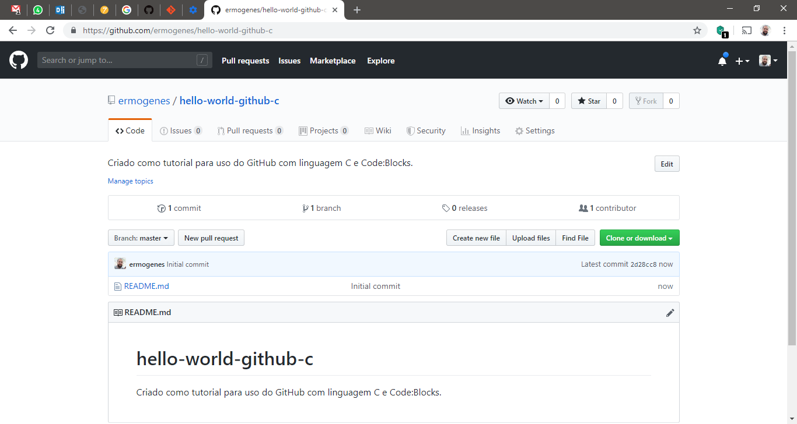

## Editando arquivos diretamente no GitHub

* Edite o arquivo de descrição do projeto, `README`, clicando no ícone de lápis à direita:


Utilize o texto que quiser. Por exemplo:

```
# hello-world-github-c
Criado como tutorial para uso do GitHub com linguagem C e Code:Blocks.

Criado por: **Ermogenes Palacio**

_Etec Adolpho Berezin, Lógica de Programação_
```

Obs.: Caso queira conhecer as opções de formatação, veja https://guides.github.com/features/mastering-markdown/.

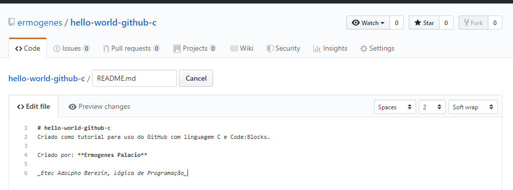

* Execute a função _Commit Changes_ para gravar as alterações do arquivo no repositório. Escreva uma mensagem curta identificando o que foi alterado. Se precisar de uma explicação mais longa, use a descrição estendida.

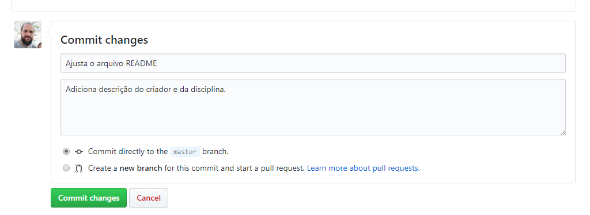

* Seu arquivo foi alterado.


## Sincronizando projeto local com projeto remoto

Neste momento temos um projeto C no Code::Blocks criado localmente. Queremos subir estes arquivos para o controle de versão do GitHub, no repositório `hello-world-github-c`.

O repositório contém o arquivo `README`, e o diretório local contém os arquivos do projeto. Vamos sincronizá-los.

* No GitHub, identifique a URL do seu repositório remoto (ex.: https://github.com/ermogenes/hello-world-github-c.git).

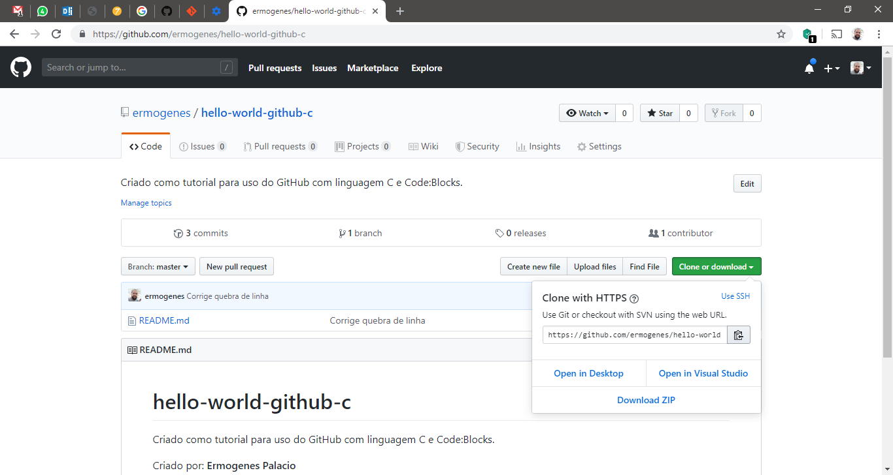

* No Prompt de Comando do Windows, acesse o diretório onde está salvo o seu projeto (ex.: `C:\Users\ermogenes\Desktop\ProjetosCB\HelloWorld`), utilizando o comando `cd`:

```
cd C:\Users\ermogenes\Desktop\ProjetosCB\HelloWorld
```

Use o comando `dir` para exibir os arquivos do diretório. Devem ser exibidos os arquivos do projeto.

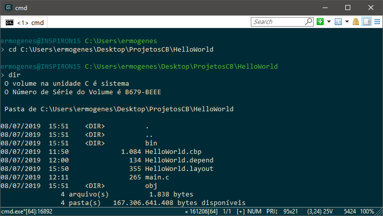

* Inicie o versionamento de arquivos local no diretório do projeto:

```
git init
```

* Adicione a referência ao repositório remoto, usando o URL do seu repositório no GitHub:

```
git remote add origin https://github.com/ermogenes/hello-world-github-c.git
```

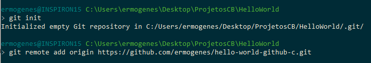

* Traga a versão armazenada remotamente para o repositório local:

```
git pull origin master
```

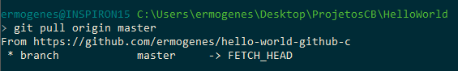

Você poderá notar a criação da pasta `.git` do versionamento local, e do arquivo `README` que estava remoto. Use o comando `dir` ou acesse a pasta pelo Windows.

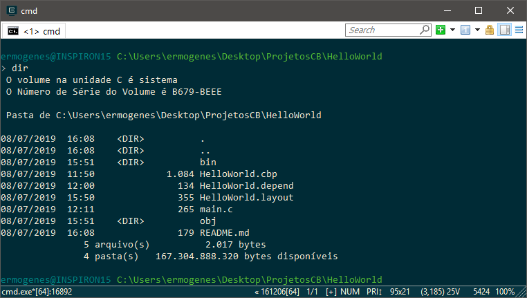

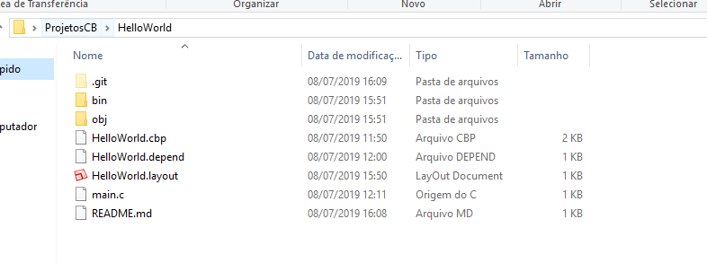

