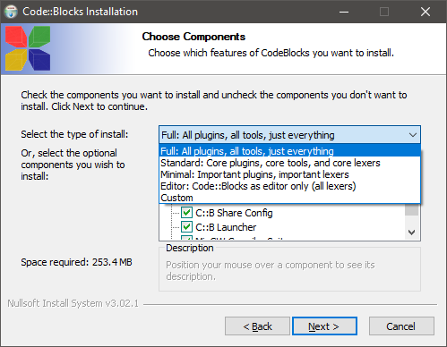
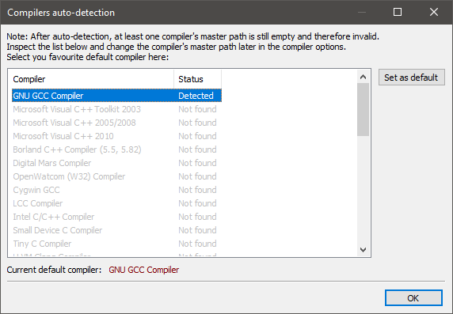
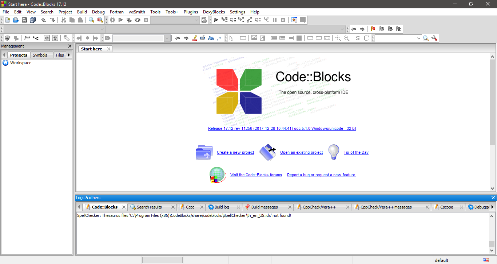

# Ambiente Code::Blocks com compilador C (Windows)

1. Baixar o Code::Blocks em http://www.codeblocks.org/downloads/binaries, opção ([`codeblocks-17.12mingw-setup.exe`](https://www.fosshub.com/Code-Blocks.html?dwl=codeblocks-17.12mingw-setup.exe)).
2. Executar o instalador baixado, e seguir o passo-a-passo até a seleção de opções de instalação.
3. Escolher a opção de instalação completa:

4. Quando solicitado, definir o compilador selecionando o instalado GNU GCC Compiler:

5. Tela do Code::Blocks após a instalação concluída:

